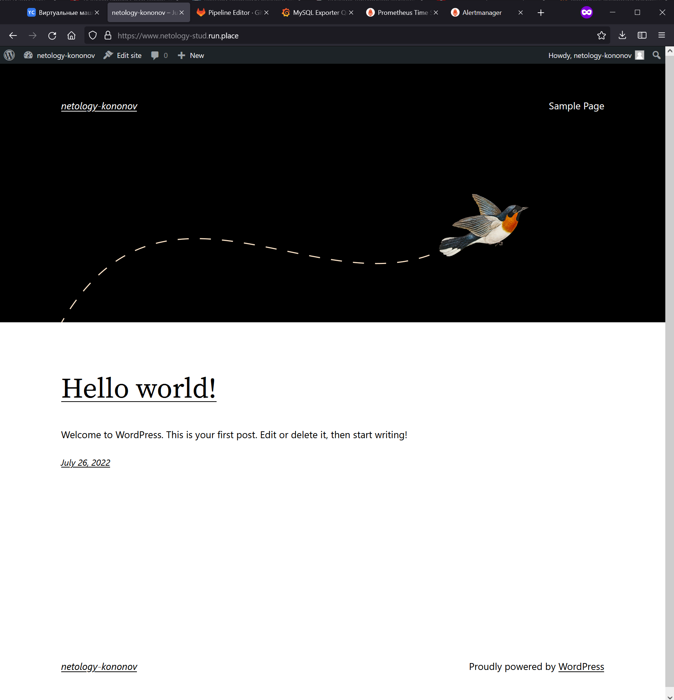
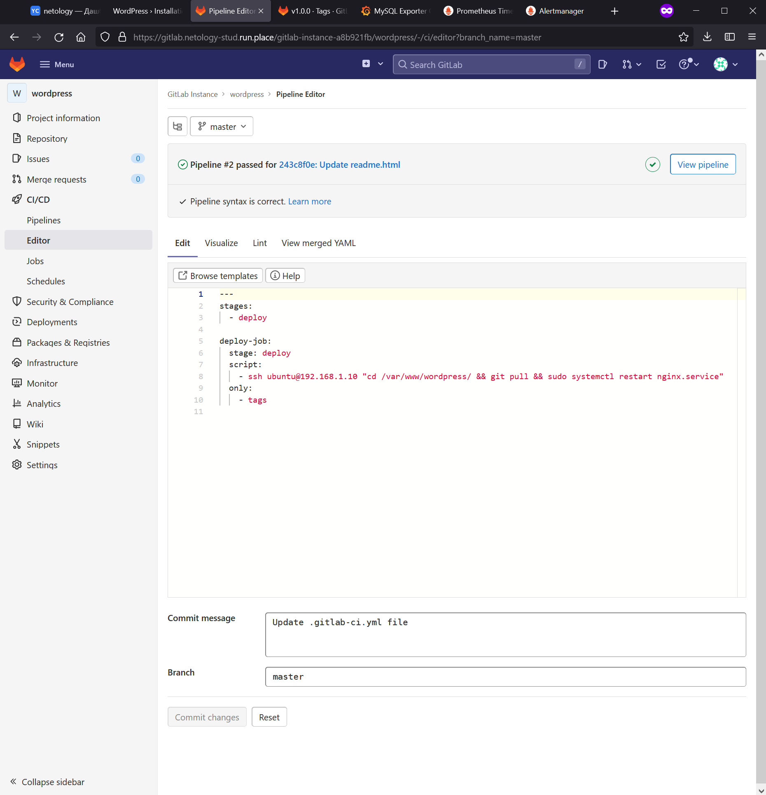
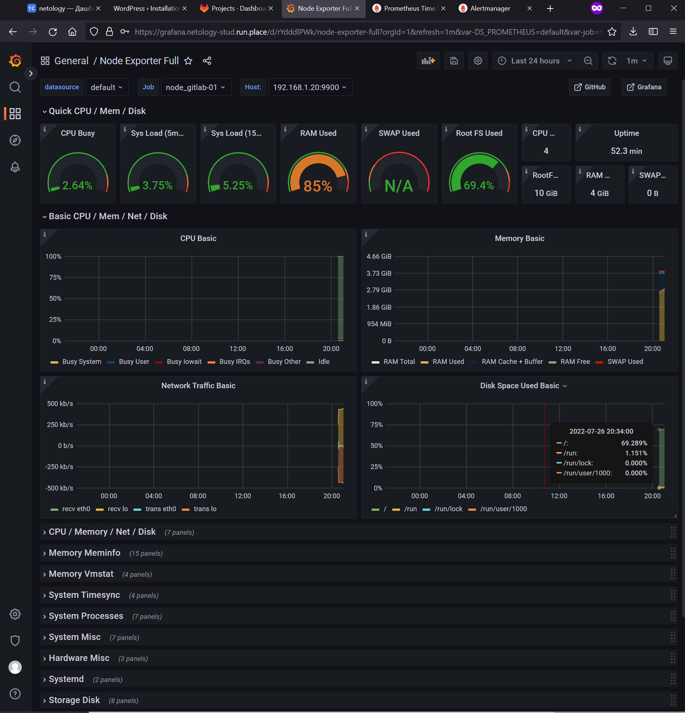
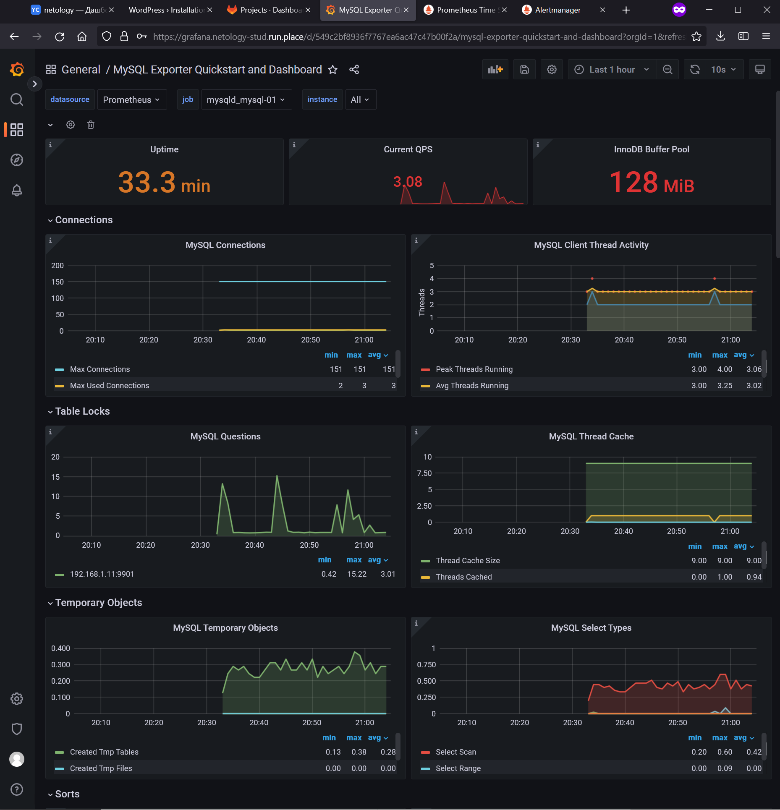
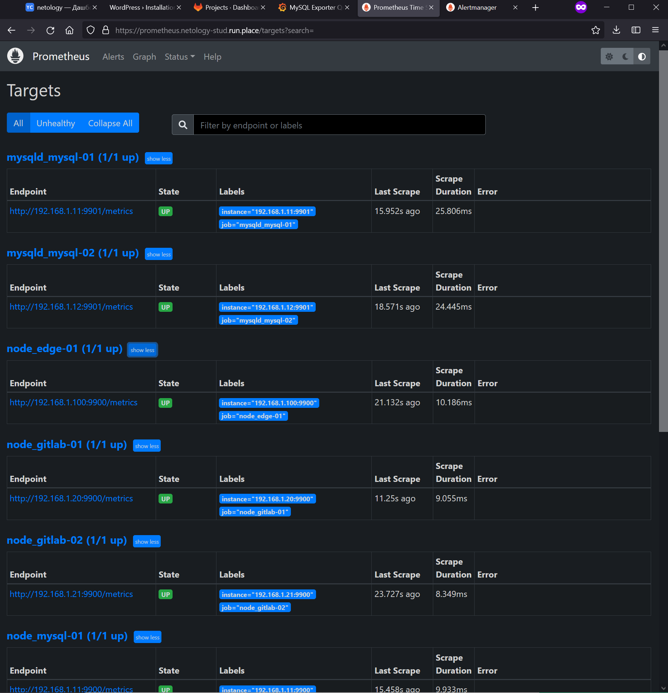
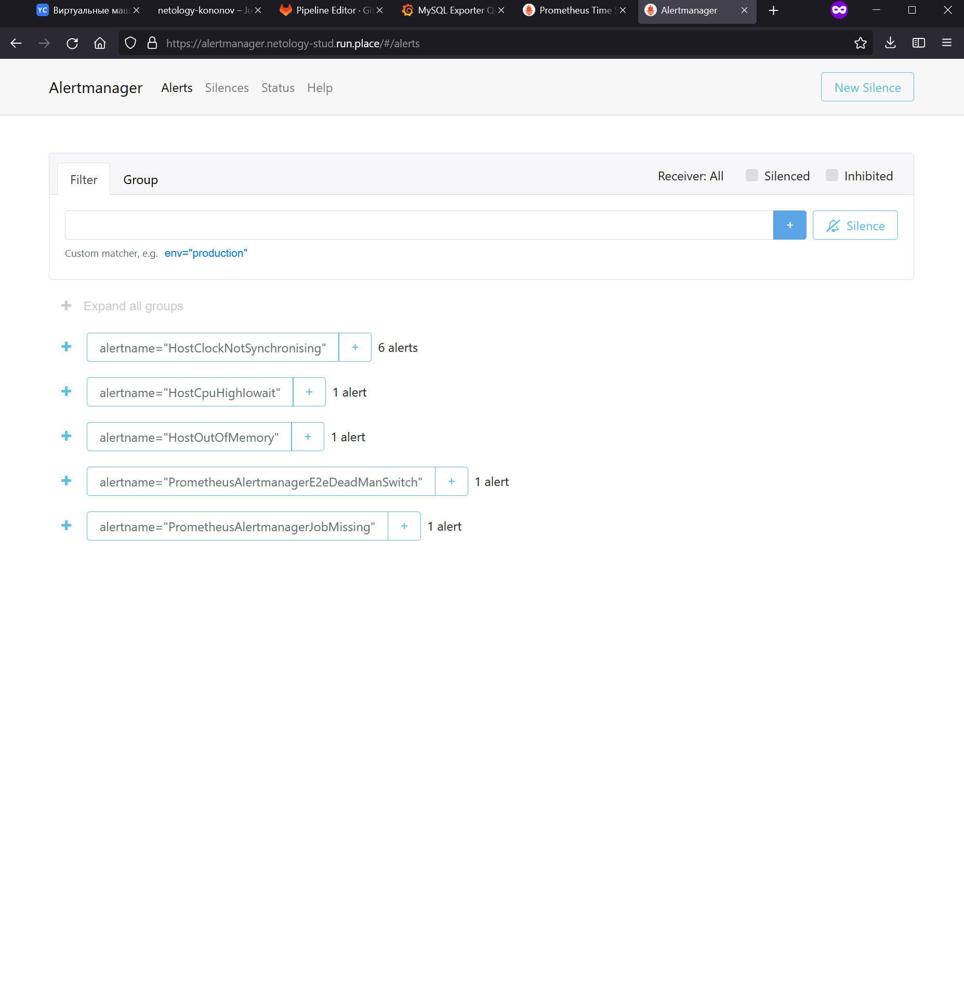

Дипломный практикум в YandexCloud.
===
1. Репозиторий со всеми Terraform манифестами и готовность продемонстрировать создание всех ресурсов с нуля.
---
https://github.com/netology-kononov/netology-graduate/tree/main/terraform  
2. Репозиторий со всеми Ansible ролями и готовность продемонстрировать установку всех сервисов с нуля.
---
https://github.com/netology-kononov/netology-graduate/tree/main/ansible  
(Вся чувствительная информация зашифрована с помощью ansible-vault, пароль передан преподавателю в личном кабинете)  
3. Скриншоты веб-интерфейсов всех сервисов работающих по HTTPS на вашем доменном имени.
- https://www.netology-stud.run.place (WordPress)  
 
- https://gitlab.netology-stud.run.place (Gitlab)  
 
- https://grafana.netology-stud.run.place (Grafana)  
  

- https://prometheus.netology-stud.run.place (Prometheus)  
 
- https://alertmanager.netology-stud.run.place (Alert Manager)  
 

5. Все репозитории рекомендуется хранить на одном из ресурсов (github.com или gitlab.com).
---
https://github.com/netology-kononov/netology-graduate
